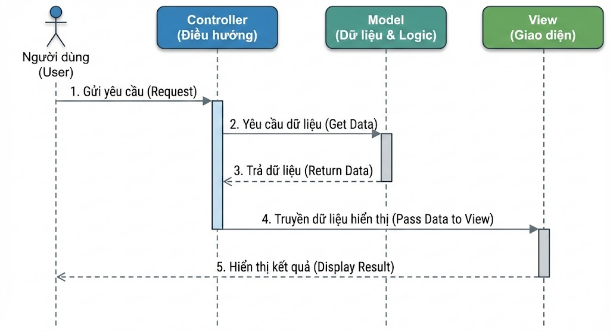

# MÔ HÌNH MVC (MODEL - VIEW - CONTROLLER)
Khi mới học lập trình, chúng ta thường viết tất cả mọi thứ vào một file (thường là trong hàm main):

- Khai báo biến dữ liệu.
- Tính toán logic (cộng trừ nhân chia, if-else).
- In kết quả ra màn hình (System.out.println).
- Lối viết này gọi là Spaghetti Code (Code rối như mỳ Ý).  

Hậu quả: Khi dự án lớn lên, nếu muốn sửa giao diện (ví dụ: đổi từ tiếng Anh sang tiếng Việt), ta lỡ tay xóa nhầm dòng code tính toán -> Chương trình hỏng.

**Giải pháp**: MVC (model-view-controller)

MVC là một Mẫu kiến trúc phần mềm (Architectural Pattern) giúp tách dự án thành 3 phần độc lập, mỗi phần có nhiệm vụ riêng biệt.
## Các thành phần trong MVC
### Model
- Có nhiệm vụ thao tác với Database
- Nó chứa tất cả các hàm, các phương thức truy vấn trực tiếp với dữ liệu
- Controller sẽ thông qua các hàm, phương thức đó để lấy dữ liệu rồi gửi qua View
### View
- Là giao diện người dùng (User Interface)
- Chứa các thành phần tương tác với người dùng như menu, button, image, text,...
- Nơi nhận dữ liệu từ Controller và hiển thị
### Controller
- Là thành phần trung gian giữa Model và View
- Đảm nhận vai trò tiếp nhận yêu cầu từ người dùng, thông qua Model để lấy dữ liệu sau đó thông qua View để hiển thị cho người dùng

## Luồng xử lý trong MVC
Luồng xử lý trong MVC rất đơn giản, nó gồm các bước như sau:
- Đầu tiên là `Request` từ người dùng được gửi từ client đến server (Xem thêm nếu bạn chưa biết về Request)
- Sau đó `Controller` dựa vào yêu cầu của người dùng tiến hành giao tiếp với `Model` để lấy data từ database
- Cuối cùng `Controller` gửi dữ liệu vừa lấy được về `View` và hiển thị ra cho người dùng trên trình duyệt.



## Code Java Demo
Chúng ta sẽ sẽ dựng mô hình MVC ngay trên ứng dụng Console đơn giản để hiểu bản chất.
Bài toán: Hiển thị và cập nhật thông tin một Sinh viên.

Bước 1: Tạo `Model`
```java
// File: Student.java
public class Student {
    private String rollNo;
    private String name;

    // Model hoàn toàn không biết View hay Controller là ai
    public String getRollNo() {
        return rollNo;
    }

    public void setRollNo(String rollNo) {
        this.rollNo = rollNo;
    }

    public String getName() {
        return name;
    }

    public void setName(String name) {
        this.name = name;
    }
}
```

Bước 2: Tạo `View` (Giao diện)
```java
// File: StudentView.java
public class StudentView {
  public void printStudentDetails(String studentName, String studentRollNo) {
    System.out.println("--- THÔNG TIN SINH VIÊN (VIEW) ---");
    System.out.println("Tên: " + studentName);
    System.out.println("Mã số: " + studentRollNo);
    System.out.println("----------------------------------");
  }
}
```

Bước 3: Tạo `Controller` (Người điều khiển)
```java
// File: StudentController.java
public class StudentController {
  private Student model;
  private StudentView view;

  // Controller cần nắm giữ tham chiếu đến cả Model và View
  public StudentController(Student model, StudentView view) {
    this.model = model;
    this.view = view;
  }

  // Các hàm để Controller tác động vào Model (Setter)
  public void setStudentName(String name) {
    model.setName(name);
  }

  public void setStudentRollNo(String rollNo) {
    model.setRollNo(rollNo);
  }

  // Các hàm để Controller lấy dữ liệu từ Model (Getter)
  public String getStudentName() {
    return model.getName();
  }

  public String getStudentRollNo() {
    return model.getRollNo();
  }

  // HÀM QUAN TRỌNG NHẤT: Cập nhật View
  public void updateView() {
    // Controller lấy dữ liệu từ Model -> Đẩy sang View
    view.printStudentDetails(model.getName(), model.getRollNo());
  }
}
```

Bước 4: Chạy chương trình (Main)
```java
// File: MVCPatternDemo.java
public class MVCPatternDemo {
    public static void main(String[] args) {
        // 1. Chuẩn bị dữ liệu (Giả lập lấy từ Database)
        Student model = retrieveStudentFromDatabase();

        // 2. Chuẩn bị giao diện
        StudentView view = new StudentView();

        // 3. Khởi tạo Controller và đưa Model + View vào quản lý
        StudentController controller = new StudentController(model, view);

        // 4. Hiển thị dữ liệu ban đầu
        System.out.println(">>> Lần đầu hiển thị:");
        controller.updateView();

        // 5. NGƯỜI DÙNG TƯƠNG TÁC: Muốn đổi tên sinh viên
        // Lưu ý: User không gọi thẳng model.setName(), mà gọi qua Controller
        System.out.println("\n>>> Sau khi chỉnh sửa:");
        controller.setStudentName("Le Minh Hieu"); // Update Model
        
        // 6. Hiển thị lại giao diện mới
        controller.updateView(); // Refresh View
    }

    // Hàm giả lập database
    private static Student retrieveStudentFromDatabase() {
        Student student = new Student();
        student.setName("Nguyen Van A");
        student.setRollNo("SV001");
        return student;
    }
}
```
# Singleton
- Là một class chỉ có 1 instance duy nhất trong suốt vòng đời của ứng dụng.
## Cách triển khai `singleton design pattern`:

- Sử dụng `private` cho hàm khởi tạo, tránh cho các đối tượng khác sử dụng từ khóa `new`
- Khởi tạo 1 biến `instance` có phạm vi là `private static`
- Một hàm `getInstance` có phạm vi là `public static` và khởi tạo đối tượng trong hàm này và trả về `instance` của đối tượng.

```java
public class UserService {

    // 1. Biến instance private static.
    private static UserService instance;

    // 2. Private Constructor để ngăn chặn việc 'new UserService()' từ bên ngoài
    private UserService() {
        // [Optional] Chặn việc dùng Reflection để khởi tạo lại
        if (instance != null) {
            throw new RuntimeException("Use getInstance() method to get the single instance of this class.");
        }
        // Giả lập việc khởi tạo tốn kém tài nguyên (ví dụ: kết nối Database, load Config...)
        // Đây là lý do ta cần Lazy Loading
        System.out.println(">> Đang khởi tạo UserService và kết nối Database...");
    }

    // 3. Phương thức public static để lấy instance (Global Access Point)
    // Áp dụng Double-Checked Locking
    public static UserService getInstance() {
        // Check lần 1: Nếu đã có instance, trả về luôn để tránh blocking (tăng hiệu năng)
        if (instance == null) {
            instance = new UserService();
        }
        return instance;
    }

    // --- Các Business Method (Nghiệp vụ thực tế) ---

    public boolean login(String username, String password) {
        // Logic giả lập kiểm tra đăng nhập
        System.out.println("UserService: Đang xử lý đăng nhập cho user [" + username + "]");
        return "admin".equals(username) && "123456".equals(password);
    }

    public void createUser(String email) {
        System.out.println("UserService: Đang tạo user mới với email: " + email);
    }
}
```

- ***Ưu điểm***:
    - Tiết kiệm bộ nhớ cho RAM, chỉ khởi tạo 1 `instance` duy nhất trong suốt vòng đời của ứng dụng.
    - Nếu sử dụng `lazy loading`, ứng dụng khởi động nhanh hơn vì không cần khởi tạo hết tất cả các tài nguyên.
    - Tiện lợi, dễ truy cập, không cần tạo đối tượng mỗi khi dùng.
    - Dễ dàng kiểm soát vòng đời.
- ***Nhược điểm***:
    - Khó khăn trong việc viết `Unit Test` vì các phụ thuộc bị gắn chặt vào đối tượng, khó cho việc `mock` data.
    - Code trở nên khó đọc, thiếu minh bạch. Người đọc cần click vào thẳng đối tượng đó để xem đối tượng bên trong dùng những phụ thuộc nào.
    - Trong đa luồng, nếu xử lý không khéo sẽ tạo ra nhiều hơn là 1 instance -> phá vỡ nguyên tắc của `singleton`

**Vậy khi nào nên dùng `Singleton` ?**
- *Chúng ta nên sử dụng singleton cho các tác vụ như `Logger`, `Configuration`, `Connection Database`, `Caching`, `ThreadPool`*
- *Tránh lạm dụng `singleton`.*

# Bài tập thực hành
- Áp dụng Singleton cho `UserService`, `UserController`
- Tạo bảng `User` trong database:
```mysql
create table User(
    id varchar(255) primary key ,
    username varchar(100) not null unique,
    password varchar(255) not null 
)
```
- Thực hiện kết nối tới Database.
- Khi người dùng chọn `Register` thì sẽ thêm mới 1 user vào bảng `User` trong Database

![](https://uml.planttext.com/plantuml/png/jLPDRnCn4Br7od-O4sn44vLFeGYXHcbf8oKf4Ce5SN1tpQxfnWwsDrKe7BY0X3YK8-e1Aa3YWiIvERRg_zX_mdWtpdgJSW297jBAC-_Dl3VEk6jA4wcJOLojL2kNeLwlGpiz-RO3MwSV-bkmsMbjmteddRxjcrYrelOO7n59Xk37HAcMrfBj9ffsVC47x2M5LJSdPfpgoOY2a3eIReIBW2ewWjkbV4dudZczjMhQqKp75Dgc3gmp4c964tOKbT0Zd8HqIBc6mKHfEWIlzxXTApIS7QRJzzX_VtFhx4SBsgTlsj3kjWO3k0IT_gEDX_TQxOrSaO5SRS06nt8JvC76OcJAvENL3geLm9ywi02QC435FBH72IPmCgHBWH72zuLSH5p9A3qMhCoXA_FSciq9gUu4Ncq9Y-SxCzJ5qVipfbBqTIxoMWC6L8wPJw5B9gZBwugG-S33YANJToCOfzFls0BZcifd1DDCBGivi5LY177FDc-h52BiYUbWLuYO4cwXaeOCfoKpT3vAasL-svHdGeQYaB5OfaIQwIhcDEkqCnp5jjlBiCdIaw-WqkbFYCz_9H0G7e4wFVQZp7_GKl0GkjYMEr65PSpP7SDx5_wVzB5WmLz8pzDdyxpUWBRWA22EKSXif6U7ECit2KJdlzBf4Q9SXvpq0rUkdN7JzT6zhmNGS_9BwRL_CScLFtU81GKeTykb-1FyRzsxqO37ZEvRtpOP4H2Oxm4thYeStjowTQAYNK5aa05ApZcEDXUSicdA9vndyK7-b-suHElvS-0YqTnP5Odz7kM9jwXzZ0JTpFQB8W-jiHS5xvLjMxBfPhOPvGJk2zmBrf4UORpO20VuXcZcluOX7dj4XlCXFNcwH7Z1TkwbqyCEFDXfzM4BNvfYBIz-gnb-v5k_T4_TDNNdLQEnY2l8d76D8jnseACadNxoONpwHPJM7Uv6eV3n4Sa87x4GNYG4EdOnrlAQ3bkzVhS4RvhReVB2vUlpXxhklIa3B7NfgXNijY8okUlWx6Es1dI4rrhZkZFB_OZbxvctJZI1xTtdrDUridsDHbuCImopDrOjINLIV4c9jeraToB6BlZvCOCzbFcPWKvFZeNv_Ax1nqrShMHfXgEaqZbV6bufulfKhQnH7k3_Bhy1)