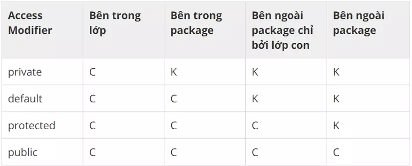
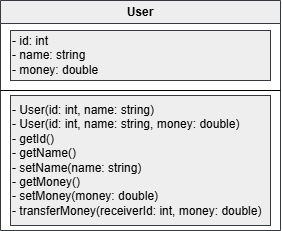

# Buổi 3: Nhập môn OOP (Object-Oriented Programming)

---

OOP là gì? OOP là một mô hình lập trình dựa trên khái niệm về đối tượng, tổ chức code xoay quanh các đối tượng, mỗi đối tượng bao gồm các thuộc tính (dữ liệu) và hành vi (phương thức), giúp việc phát triển phần mềm trở nên trực quan, dễ bảo trì và mở rộng hơn

- Đối tượng (Object): bao gồm 2 thông tin: thuộc tính và phương thức
- Thuộc tính (attribute): là các biến được sử dụng để lưu trữ những thông tin, đặc điểm của đối tượng. Họ tên, tuổi, địa chỉ, …
- Phương thức (method): chính là các hàm được sử dụng để thực hiện các hành động của đối tượng đó. Ăn, ngủ, đi chơi, …

---
## 1. Package và Class
- Package được coi như là 1 folder chứa các file code, tài liệu có cùng chung 1 mục đích, tác dụng nhằm dễ dàng trong việc quản lí source code cũng như t
- Lớp (Class): là nơi định nghĩa các thông tin của đối tượng, có thể hiểu như là kiểu dữ liệu do chúng ta tự định nghĩa

```java
class DongVat {
    // Các thuộc tính (attributes)
    String name;
    int year;
    String description;
    double weight;

    // Các phương thức (methods)
    public void display() {
        System.out.println("Name: " + name);
        System.out.println("Year: " + year);
        System.out.println("Description: " + description);
        System.out.println("Weight: " + weight);
    }
}
```

## 2. Phạm vi truy cập



## 3. Constructor và Getter, Setter
### Constructor
```java
class DongVat {
    private String name;
    private double weight;
    
    public DongVat() {};
    public DongVat(String name, double weight) {
        this.name = name;
        this.weight = weight;
    }
}
```

- Hàm khởi tạo không có kiểu trả về
- Hàm khởi tạo phải có tên trùng với tên Class và phạm vi truy cập `public`
- Nếu không khai báo hàm khởi tạo, mặc định chương trình sẽ tự động tạo hàm khởi tạo không tham số
- Có thể có nhiều hàm khởi tạo

### Getter và Setter
- Sử dụng để thao tác với các thuộc tính của đối tượng 1 cách gián tiếp, đảm bảo tính đóng gói của đối tượng
```java
class DongVat {
    private String name;
    private double weight;
    
    public DongVat() {};
    public DongVat(String name, double weight) {
        this.name = name;
        this.weight = weight;
    }
    
    public void setName(String name) {
        this.name = name;
    }
    
    public String getName() {
        return this.name;
    }
    
    public void setWeight(double weight) {
        this.weight = weight;
    }
    
    public double getWeight() {
        return this.weight;
    }
}

public class Main {
    public static void main(String[] args) {
        DongVat dog = new DongVat("Dog", 20);

        System.out.println(dog.getWeight());
        
        dog.setWeight(30);
        
        System.out.println(dog.getWeight());
    }
}
```

## 4. Từ khóa `this`
- Trong Java, từ khóa "this" tham chiếu đến thể hiện của lớp đang thực thi, cho phép truy cập vào các thành viên (biến và phương thức) của thể hiện đó
```java
public class Student {
    private String name;
    
    public Student(String name) {
        this.name = name; // Gán giá trị cho biến name của thể hiện đang được khởi tạo
    }
}
```

## Bài tâp thực hành
### Bài 1: Thiết kế lớp User với các thông tin như sau:

### Bài 2: Từ lớp User đã tạo ở bài 1, hãy khởi tạo 1 mảng đối tượng User bao gồm 3 User và thực hiện chức năng chuyển tiền cho nhau