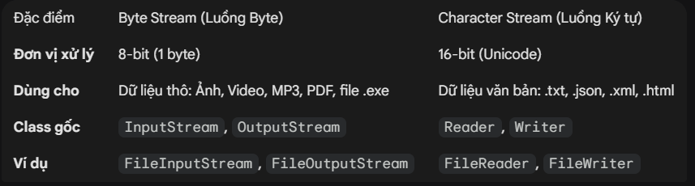

# Thread, Regex, Exception, I/O

## Cơ bản về Thread (Luồng)
### 1.Thread là gì? Tại sao cần dùng?
- Khái niệm: Thread (Luồng) là đơn vị nhỏ nhất của việc xử lý trong một chương trình. Mặc định, Java chạy trên main thread.

- Ví dụ thực tế: Hãy tưởng tượng một nhà hàng. 
  - Single-thread (Đơn luồng): Chỉ có 1 nhân viên phục vụ. Cô ấy phải lấy order bàn 1, chờ bếp nấu, mang ra bàn 1, rồi mới được sang bàn 2. Khách hàng bàn 2 sẽ chờ rất lâu.
  - Multi-thread (Đa luồng): Có 5 nhân viên. Trong khi nhân viên A chờ bếp nấu cho bàn 1, nhân viên B có thể đi lấy order ở bàn 2. Mọi việc diễn ra song song.
  - 
- Bình thường chúng ta code và chạy file Main, không có tác vụ nào khác, khi này code của chúng ta sẽ chạy một cách tuần tự, xử lí các tác vụ, công việc một cách tuần tự
- Khi có nhiều các tác vụ cần xử lí đồng thời, khi này ta cần đến multithread.
- Để hiểu và áp dụng được multithread thì ta cần hiểu về thread, cách tạo và chạy 1 thread.
### 2. Cách tạo Thread trong JAVA
- Để tạo 1 thread ta có 2 cách

#### **Cách 1**: Ta cần kế thừa lại lớp `Thread` có sẵn trong java và override lại method run()
```java
// Định nghĩa 1 thread
class MyThread extends Thread {
    @Override
    public void run() {
        System.out.println("Thread đang chạy công việc A");
    }
}

// Cách khởi chạy
class Main {
    public static void main(String[] args) {
        MyThread thread = new MyThread();
        thread.start();
    }
}
```

#### **Cách 2**: Ta triển khai interface `Runnable` của thư viện `java.lang`
```java
// Tạo 1 class triển khai Runnable
class MyThread implements Runnable {
    @Override
    public void run() {
        System.out.println("Thread đang chạy công việc A");
    }
}

// Cách khởi chạy
class Main {
    public static void main(String[] args) {
        Thread thread = new Thread(new MyThread());
        thread.start();
    }
}
```

- **Lưu ý**: Tránh nhầm lẫn giữa lời gọi `.run()` và `.start()`
  - Khi gọi `.run()` thực chất chỉ là một lời gọi hàm thông thường, chương trình sẽ không tạo ra 1 luồng mới mà chỉ chạy trên luồng chính (Main thread)
  - Khi gọi `.start()`, khi này JVM sẽ cấp phát và tạo ra 1 luồng mới, tự động gọi hàm `.run()` và chạy song song với luồng chính (Main thread)

#### 3. Vòng đời của Thread (Thread Lifecycle)
- Hiểu vòng đời giúp bạn biết tại sao thread bị dừng hoặc chết.
  - New: Vừa được khởi tạo (new Thread()).

  - Runnable: Sẵn sàng chạy, đang chờ CPU cấp phát tài nguyên.

  - Running: Đang thực thi mã lệnh.

  - Blocked/Waiting: Đang chờ một thread khác (ví dụ chờ dữ liệu I/O, chờ khóa synchronized).

  - Terminated: Hoàn thành công việc hoặc bị lỗi.
#### 4. Các vấn đề cốt lõi và Lỗi thường gặp

##### A. Race Condition (Điều kiện đua)
Xảy ra khi nhiều thread cùng truy cập và sửa đổi một dữ liệu chung cùng lúc, dẫn đến dữ liệu sai lệch.
- Ví dụ thực tế: Tài khoản ngân hàng.
  - Tài khoản có 100$.
  - Vợ (Thread A) rút 50$.
  - Chồng (Thread B) rút 50$ cùng thời điểm.
  - Nếu không kiểm soát, cả hai cùng thấy số dư là 100$ trước khi lệnh trừ tiền được ghi lại. Kết quả: Cả hai rút được tiền, tổng rút 100$, nhưng số dư có thể vẫn còn 50$ (sai lệch).

- Cách khắc phục: Sử dụng từ khóa synchronized. Nó giống như việc "khóa cửa nhà vệ sinh", chỉ một người vào, người khác phải đợi người kia ra mới được vào.

```java
class BankAccount {
    private int balance = 1000000; // Có 1 triệu

    // Hàm rút tiền KHÔNG AN TOÀN (chưa có synchronized)
    public void withdraw(int amount, String name) {
        System.out.println(name + " đang kiểm tra số dư...");

        // 1. Kiểm tra điều kiện (Check)
        if (balance >= amount) {
            // Giả lập độ trễ của mạng/database (mấu chốt gây lỗi ở đây)
            // Trong lúc ông chồng đang chờ, bà vợ chen vào kiểm tra và thấy tiền vẫn còn
            try { Thread.sleep(1000); } catch (InterruptedException e) {}

            // 2. Trừ tiền (Act)
            balance = balance - amount;
            System.out.println(name + " đã rút thành công " + amount);
        } else {
            System.out.println(name + " giao dịch thất bại (Không đủ tiền).");
        }
    }

    public int getBalance() {
        return balance;
    }
}

public class RaceConditionRealWorld {
    public static void main(String[] args) throws InterruptedException {
        BankAccount sharedAccount = new BankAccount();

        // Thread Chồng
        Thread husband = new Thread(() -> {
            sharedAccount.withdraw(10_000_000, "Ông Chồng");
        });

        // Thread Vợ
        Thread wife = new Thread(() -> {
            sharedAccount.withdraw(10_000_000, "Bà Vợ");
        });

        husband.start();
        wife.start();

        // Chờ 2 người rút xong để kiểm tra số dư cuối
        husband.join();
        wife.join();

        System.out.println("----------------------------------");
        System.out.println("Số dư cuối cùng: " + sharedAccount.getBalance());
        // KẾT QUẢ SẼ LÀ: -1 triệu (Lỗi nghiêm trọng)
    }
}
```
##### B. Deadlock (Tắc nghẽn)
Hai thread chờ nhau giải phóng tài nguyên, dẫn đến cả hai đứng yên mãi mãi.

Ví dụ thực tế: Chuyển tiền ngân hàng.

Xe A đi vào và cần khoảng trống của Xe B để thoát ra.

Xe B đi vào và cần khoảng trống của Xe A để thoát ra.

Cả hai xe đứng nhìn nhau mãi mãi

- Cách khắc phục: Tránh việc lồng ghép các khối synchronized (Nested Locks) nếu không cần thiết. Luôn lock các tài nguyên theo một thứ tự nhất định.
- Khi này ta sẽ phải xử lí logic chứ không còn là thêm các từ khóa code nữa, ta phải có logic nghiệp vụ khác
### 5. Kiến thức nâng cao: Không dùng new Thread() nữa!
Trong các dự án thực tế (Enterprise), người ta hiếm khi dùng new Thread() thủ công vì khó quản lý số lượng (tạo 1000 thread sẽ làm sập RAM). Chúng ta dùng ExecutorService (Thread Pool).

- Ví dụ thực tế: Quầy giao dịch ngân hàng.
  - Thay vì mỗi khi có khách đến lại tuyển 1 nhân viên mới (tạo Thread mới - tốn kém), ngân hàng chỉ có cố định 5 quầy (Fixed Thread Pool).
  - Nếu có 100 khách, 5 khách được phục vụ, 95 khách còn lại xếp hàng (Queue).
```java
import java.util.concurrent.ExecutorService;
import java.util.concurrent.Executors;

public class ThreadPoolExample {
    public static void main(String[] args) {
        // Tạo một hồ chứa chỉ có 3 nhân viên (Threads)
        ExecutorService executor = Executors.newFixedThreadPool(3);

        // Gửi 10 công việc vào
        for (int i = 0; i < 10; i++) {
            int taskId = i;
            executor.submit(() -> {
                System.out.println("Nhân viên " + Thread.currentThread().getName() + " đang xử lý task " + taskId);
                try { Thread.sleep(1000); } catch (InterruptedException e) {}
            });
        }
        
        executor.shutdown(); // Đóng cửa sau khi làm hết việc
    }
}
```
## Xử lí Exception
- Bình thường khi code, sẽ có những lỗi xảy ra mà ta không thể ngờ được, chia làm 2 loại exception:
  - Checked Exception (xảy ra khi compile)
  - Unchecked Exception (xảy ra khi runtime)
- Để xử lí các lỗi này, ta có rất nhiều cách, về cơ bản và áp dụng nhiều, ta sẽ sử dụng `try-catch-finally`
```java
try {
    // Khối lệnh mà bạn nghi ngờ sẽ xảy ra lỗi    
} catch (Exception e) {
    // Khi có Exception ném ra thì thực hiện các hành vi ở đây
} finally {
    // Thực hiện cuối cùng sau khi đã chạy ở trên.
}
```

- Luồng thực hiện của `try-catch-finanlly`:
  - Code ở `try` sẽ chạy trước, nếu có exception ném ra, sẽ nhảy vào khối `catch` để handling
  - Cuối cùng khối `finally` luôn luôn được chạy dù khối `try` có ném ra exception hay không.
- Bên cạnh đó ta cũng có thể custom các exception của riêng mình định nghĩa sao cho phù hợp dự án.
- Để tự tạo 1 handle exception, ta sẽ kế thừa lại class `Exception` hoặc `RuntimeException` và dùng từ khóa new để khởi tạo handle exception đó

```java
class InvalidCalculateException extends RuntimeException {
    public InvalidCalculateException(String message) {
        super(message);
        System.out.println(message);
    }
}

class Main {
    public static void main(String[] args) {
        try {
            int a = 0, b = 5;
            System.out.println(a/b);
        } catch (Exception e) {
            throw new InvalidCalculateException("Tính toán xảy ra lỗi");
        } finally {
            System.out.println("Hoàn thành việc tính toán");
        }
    }
}
```

## Java I/O
- Trong java có rất nhiều cách để thực hiện đọc ghi dữ liệu sử dụng Java IO
- Bài học hiện tại, ta chỉ tim hiểu về đọc ghi file. Bên cạnh đó còn rất nhiều công việc cần đến đọc ghi như trong socket, http,...
- Để thực hiện đọc ghi 1 file dữ liệu, ta sử dụng `FileReader` và `FileWriter`
### 1. Tư duy cốt lõi: Dòng chảy (Stream)
Java coi việc đọc/ghi file giống như một dòng nước chảy qua ống dẫn.

- Input Stream: Dòng nước chảy từ nguồn (File) vào chương trình của bạn.

- Output Stream: Dòng nước chảy từ chương trình của bạn ra bể chứa (File).

Để dễ hiểu, Java chia làm 2 loại ống dẫn chính:

```java
import java.io.FileReader;
import java.io.FileWriter;

class Main {
    public static void main(String[] args) {
        String path = "";

        // Đọc file
        FileReader reader = new FileReader(path);
        int text = reader.read();
        while (text != -1) {
            System.out.println(text);
            text = reader.read();
        }

        // Ghi file
        FileWriter reader = new FileWriter(path);
        int text = reader.read();
        while (text != -1) {
            System.out.println(text);
            text = reader.read();
        }
    }
}

```

## Regex
- Khái niệm: regular expression hay còn gọi là biểu thức chính quy là 1 chuỗi những kí tự liên tục, thường được sử dụng để so khớp dữ liệu có phù hợp với mong muốn của người dùng hay không theo một quy tắc nhất định. Hiểu đơn giản là kiểm tra tính hơp lệ của chuỗi VD: Email, Phone number, username, password hợp lệ ...
```java
    String email1 = "admin@gmail.com";
    String phoneNumber1 = "0123456789";
    String phoneNumber2 = "0333484asd";
```
- Sử dụng regex để kiểm tra tính hợp lệ của chuỗi
  - Pattern: là đối tượng mẫu biên dịch từ regex, hiểu đơn giản là bộ lọc, thường sử dụng phương thức compile(regex) để biên dịch biểu thức
  - Matcher: là phương tiện để so khớp chuỗi với regex, thường sử dụng phương thức matcher(string) để so khớp string với biểu thức
- Quy tắc viết regex:
  - Dấu . : khớp bất kì kí tự đơn nào
  - Dấu ^ : khớp với phần đầu của chuỗi hoặc sử dụng để phủ định
  - Dấu $ : khớp với phần cuối của chuỗi
  - Dấu ? : tối thiểu số kí tự bằng 0 và tối đa là 1
  - Dấu + : tối thiểu số kí tự bằng 1 và tối đa là nhiều
  - Dấu * : tối thiểu số kí tự bằng 0 và tối đa là nhiều
  - {n} : có chính xác n lần xuất hiện
  - {n , } : có chính xác n hoặc nhiều hơn lần xuất hiện
  - {n , m} : có ít nhất n hoặc nhiều nhất m lần xuất hiện
  - (...) : khớp với các kí tự trong ()
  - [...] : khớp với bất kì kí tự nào trong []
  - [^...] : khớp với bất kì kí tự nào không trong []
  - [m-n] : khớp với từ kí tự m đến n trong bảng ASCII
  - \d : khớp với ký tự là chữ số, viết tắt của [0-9]
  - \D : khớp với ký tự không phải là chữ số, viết tắt của [^0-9]
  - \s : khớp với bất kỳ ký tự trống nào (dấu cách, tab, xuống dòng), viết tắt của [\t\n\x0B\f\r]
  - \S : khớp với bất kỳ ký tự không phải ký tự trống, viết tắt của [^\s]
  - \w : khớp bất kỳ ký tự chữ nào (chữ cái và chữ số), viết tắt của [a-zA-Z0-9]
  - \W : khớp bất kỳ ký tự nào không phải chữ cái và chữ số, viết tắt của [^\w] ...

- Ví dụ:
```java
    String regexPhoneNumber = "^0\\d{9}$"; // bắt đầu là 0 theo sau là 9 kí tự là số từ 0-9
    String regexMail = "^[A-Za-z0-9]+@[A-Za-z0-9]+\\.[A-Z|a-z]{2,}$"; // bắt đầu là chuỗi bắt kì + @ + chuỗi bất kì + dấu . + bất kì > 2 kí tự
    String regexPassword = "^.{8,}$"; // bắt đầu là bất kì kí tự nào và có ít nhất 8 kí tự
    String regexUsername = "^[a-z]{4,}$"; // tất cẩ là kí tự từ a-z và có ít nhất 4 kí tự

    String phoneNumber = "0355396153";

    Pattern pattern = Pattern.compile(regexPhoneNumber);
    Matcher matcher = pattern.matcher(phoneNumber);

    // (matcher.find())
    if(matcher.matches()) {
        System.out.println("SDT hop le");
    } else {
        System.out.println("SDT khong hop le");
    }


    // Dùng regex xóa khoảng trắng thừa
    String input = "   Hello     moi      nguoi   ";
    String result = input.replaceAll("\\s+", " ").trim();

    System.out.println(input);

```